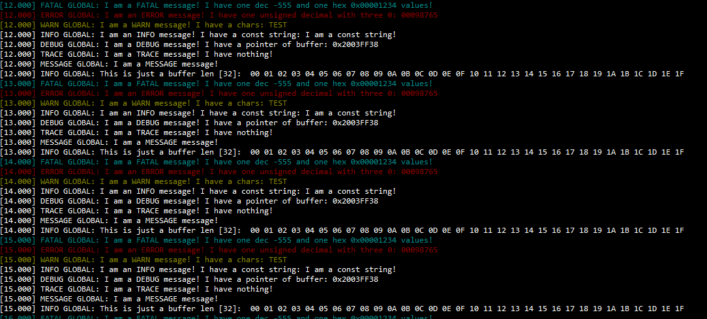

# Embedded printf and trace

**Compact printf and trace component with compile-time checks and calculation for embedded systems (used C++20 features).**
**The main goal of the component is to decrease time for string literals formatting for traces (compared to the standard snprintf function).**

## Comparison

- **5** times faster in average than std::snprintf() nano (with --specs=nano.specs for the strings with 1-5 parameters for all specifiers)
- **20** times faster for data buffers

It was achieved because of moving string literals to compile time area and compile-time calculations of the specifier properties(type, position, et cetera).

## Supported specifiers

```cpp
  enum Specifier : char {
    SignedDecimalInteger = 'd',
    UnsignedDecimalInteger = 'u',
    UnsignedHexadecimalInteger = 'X',
    Character = 'c',
    StringOfCharacters = 's',
    PointerAddress = 'p',
    Time = 't',
    Boolean = 'b'
  };
```

SignedDecimalInteger and UnsignedDecimalInteger support width. For example, it is possible to write %08u so up to 7 zeros might be added to the left side of the number.

The specifiers that are not standard:

1. Time - supposed to provide time from the system launch in ms (same as %u.%03u)
2. Boolean - add "TRUE" or "FALSE" according to the provided condition

## Compile time checks

1. The quantity of the specifiers in the string should be the same as quantity of the passed parameters
2. Each specifier has some type restriction, for example UnsignedDecimalInteger - should be unsigned integral
3. The width can be only used with decimals

## Usage

As the module is oriented to traces, the main class is supposed to use is Log. However, despite class Format is a kind of service for the Log, it can be used separately and it is reasonable to start with it.

In this example I used RTT interface from SEGGER JLINK debugger to output the traces to the terminal (So it is a ThirdParty module).
It contains to necessary functions:

1. SEGGER_RTT_Init - to initialize the interfase
2. SEGGER_RTT_WriteString - put string to output terminal

For the Log class is also necessary to provide some system time function which returns the current millisecond from the launch.
I am using my own system time component so my function is resource::resource.system.Time

### Format

First of all, the output integration class should be created:

```cpp
class DebugPuts final {
public:
  inline DebugPuts() {
    // Assert to check the compliance with the concept
    static_assert(iso::format::put<DebugPuts>, "The class should implement a whole concept interface!");
    SEGGER_RTT_Init(); // Init the interface
  }
  // Put string function
  inline void puts(const char *buf) const { SEGGER_RTT_WriteString(0, buf); }
};
```

Secondly, objects can be created:

```cpp
static DebugPuts debugPuts;
static constexpr iso::format::Format print{debugPuts};
```

Finally, we can use printf:

```cpp
// Example 1
print.printf(iso::format::string<"This is just a string">);

// Example 2
unsigned someDynamicVariable = 666;
print.printf(iso::format::string<"This is decimal representation %u, or with additional zeros %08d, or in hex %X!">, someDynamicVariable, someDynamicVariable, someDynamicVariable);

// Example 3 (buffer)
char buf[64];
print.printf(iso::format::string<"This is just a buffer len [%u]: ">, iso::format::DataBuffer(buf, sizeof(buf)), sizeof(buf));
```

### Log

The traces have different levels:

```cpp
enum class Trace : unsigned {
  All,

  Trace,
  Debug,
  Info,
  Warn,
  Error,
  Fatal,

  None
};
```

By default - all levels will be displayed.

First of all, we should extend the DebugPuts object with adding tick function:

```cpp
class DebugPuts final {
public:
  inline DebugPuts() {
    // iso::log::time concept includes iso::format::put
    static_assert(iso::log::time<DebugPuts>, "The class should implement a whole concept interface!");
    SEGGER_RTT_Init();
  }

  inline void puts(const char *buf) const { SEGGER_RTT_WriteString(0, buf); }
  inline unsigned tick() const { return resource::resource.system.Time(); } //added
};
```

Secondly, objects can be created:

```cpp
// Display levels from Warn to Fatal with highlight, all messages contains the component name ("GLOBAL")
static constexpr iso::log::Log debug{debugPuts, log::log_lvl<log::Trace::Warn, log::Highlight::Enabled>, iso::format::string<"GLOBAL">};

// Also can be initialized (just examples):
// static constexpr iso::log::Log debug{debugPuts} //Display all levels without prefix and highlight
// static constexpr iso::log::Log debug{debugPuts, log::log_lvl<log::Trace::Debug>} //Display levels from Debug to Fatal without prefix and highlight
// static constexpr iso::log::Log debug{debugPuts, iso::format::string<"USB">} //Display levels with USB prefix and without highlight
```

Finally, example of application (spam each second):

```cpp
char buf[50];
debug.fatal(iso::format::string<"I am a FATAL message! I have one dec %d and one hex %X values!">, -555, 0x1234U);
debug.error(iso::format::string<"I am an ERROR message! I have one unsigned decimal with three 0: %08u">, 98765U);
debug.warning(iso::format::string<"I am a WARN message! I have a chars: %c%c%c%c">, 'T', 'E', 'S', 'T');
debug.info(iso::format::string<"I am an INFO message! I have a const string: %s">, iso::format::string<"I am a const string!">);
debug.debug(iso::format::string<"I am a DEBUG message! I have a pointer of buffer: %p">, buf);
debug.trace(iso::format::string<"I am a TRACE message! I have nothing!">);
debug.message(iso::format::string<"I am a MESSAGE message!">);
debug.info(iso::format::string<"This is just a buffer len [%u]: ">, iso::format::DataBuffer(buf, sizeof(buf)), sizeof(buf));
```

In the JLINK terminal it looks like:



It is supposed, the Log objet will be created in each needed component class as a static constexpr variable.
For example, when traces are needed it can be defined:

```cpp
class Udp {
    ...
    static constexpr iso::log::Log trace{debugPuts, iso::format::string<"UDP">};
    ...
}
```

After component was debugged, it can be powered off:

```cpp
class Udp {
    ...
    static constexpr iso::log::Log trace{debugPuts, log::log_lvl<log::Trace::None>, iso::format::string<"UDP">};
    ...
}
```

The message(...) method prints string without relation to the Trace::Level.
So this method is only for debug purposes in some extraordinary case.

The source location information have not been added yet.
If it will be discovered that this information is useful for module - it will be added.
For now it is possible to add it externally, for example, in some assert statement.
